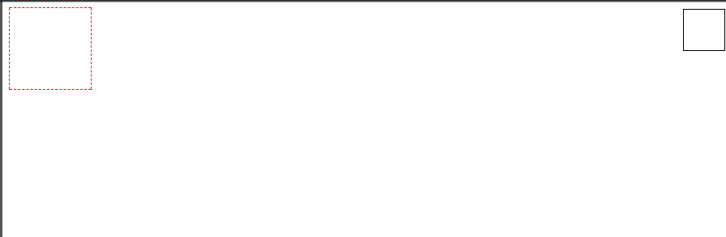

# Posicionamento (position)

A propriedade `position` em CSS representa a forma com que o elemento é disposta na página. No fluxo normal, um elemento é empilhado em cima do outro, como se fosse uma pilha convencional:

```
div
  section
    h2
    p
nav
  ul
```

E é deste maneira com que são renderizados na página.

Porém, podemos mudar isto com a propriedade `position` que tem valores bem curiosos.

Antes de entrar em cada valor específico, vamos deixar claro que, todas as propriedades são regidas por valores direcionais, ou seja, `top | right | bottom | left`.
Isso significa que se quisermos que o elemento esteja há `10px` à esquerda, após definirmos qual a `position`, definimos que `left: 10px`. Mas isso ficará mais claro com os exemplos a seguir.

## Relative
A propriedade `relative`, indica que o elemento se posicionará relativamente a **ELE MESMO**, ou seja, ele continuará ocupado a posição do fluxo normal, entretanto, o conteúdo dele será deslocado.


## Absolute
A propriedade `absolute` indica que o elemento sairá do fluxo natural da página, e ficando de forma relativa ao ancestral posicionado mais próximo. Confuso? Veja o exemplo:

> Nota: Elemento POSICIONADO é qualquer elemento que tenha uma posição definida `position: relative | absolute | fixed`

```html
<div class="first">
  <div class="second"></div>
</div>
```

```css
.first{
  width: 100px;
  height: 100px;
  border: 1px dashed red;
}

.second{
  width: 50px;
  height: 50px;
  border: 1px solid black;
  position: absolute;
  top: 10px;
  right: 5px;
}
```

No caso acima, o elemento `second` sairá de dentro do `first` e se posicionará de acordo com o seu elemento ancestral posicionado, que no caso, é a janela (o pai de todos):




### Tasty Treats 
Aqui, cabe um truque que é bastante usado: quando queremos que um elemento se comporte de forma `absoluta` ao seu pai imediato, podemos definir o pai como `relative` e não passar nenhum valor, ou seja, ele se manterá no posicionamento natural, e então, aplicar o `absolute` no seu filho.

Dessa forma, o ancestral posicionado mais próximo será seu pai, fazendo com que ele se posicione relativo a ele. Veja o mesmo exemplo usado acima, mas adicionando o `relative` no elemento `first`:

```css
.first{
  width: 100px;
  height: 100px;
  border: 1px dashed red;
  position: relative;
}

.second{
  width: 50px;
  height: 50px;
  border: 1px solid black;
  position: absolute;
  top: 10px;
  right: 5px;
}
```

Resultado:


