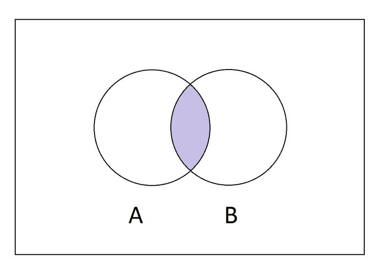

# Intersection

Lembra das aulas de matemática/estatística?



Usado quando queremos combinar multiplos tipos:

```ts
type Animal = {
  breath: () => void;
};

type Biped = {
  walkInTwoLegs: () => void;
};

type Quadruped = {
  walkInFourLegs: () => void;
};

type Horse = Animal & Quadruped;
type Human = Animal & Biped;
```

No exemplo acima, dizemos que `Horse` é do tipo `Animal` E `Quadruped`. Já `Human` é do tipo `Animal` E `Biped`.
